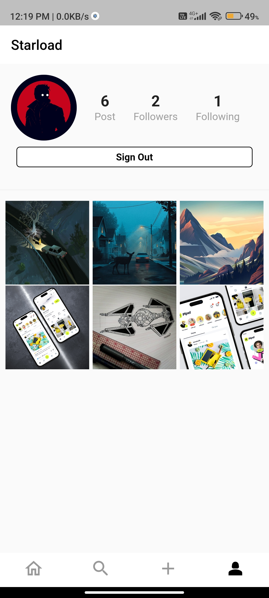
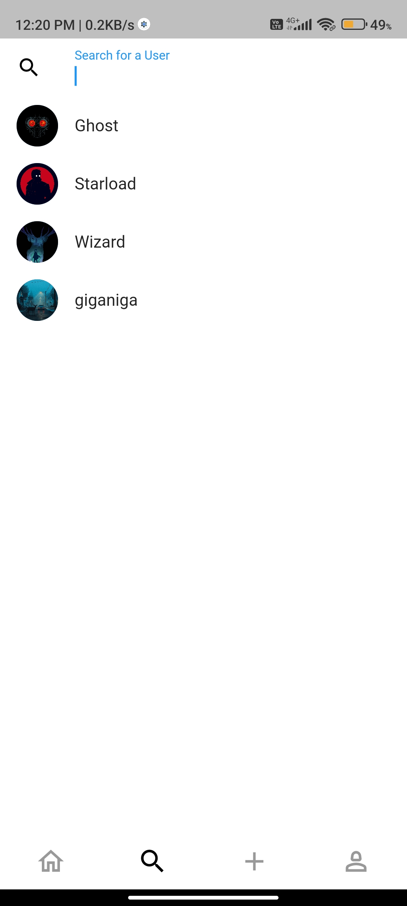
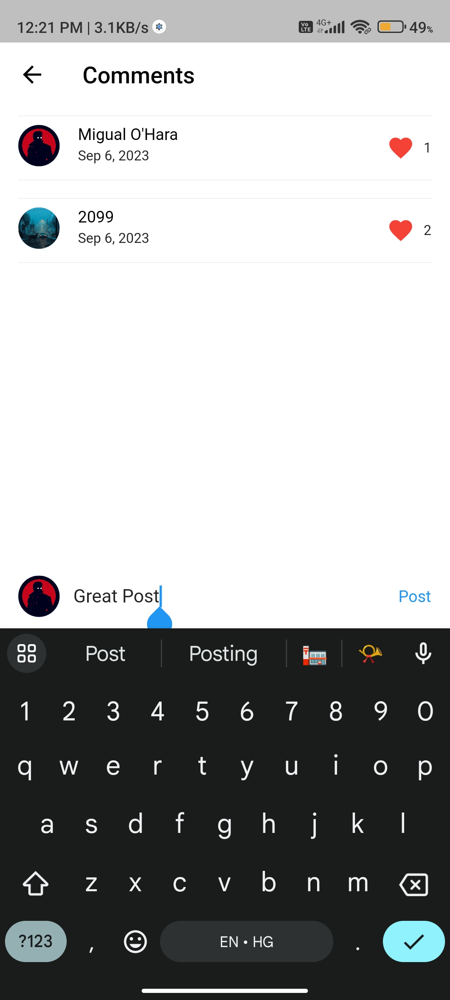

# Instagram Clone App

This is a Flutter application built to mimic the functionality of Instagram, allowing users to post photos, comment, follow other users, like posts, and more. The app is integrated with Firebase for authentication, storage, and database functionalities.

## Features

- Authentication: Users can sign up, sign in, and sign out securely using Firebase Authentication.
- Feed: Users can scroll through a feed of posts from users they follow.
- Post Creation: Users can create and upload posts with captions and images.
- Comments: Users can comment on posts, view comments, and interact with them.
- Likes: Users can like and unlike posts.
- Follow/Unfollow: Users can follow or unfollow other users to see their posts in their feed.
- Profile: Users have their own profile page where they can view their posts, followers, following, and edit their profile details.
- Search: Users can search for other users by username.
## Screenshots

  
  
  


## Technologies Used

- Flutter: Cross-platform UI framework for building natively compiled applications for mobile, web, and desktop from a single codebase.

- Firebase: Backend-as-a-Service platform provided by Google, used for authentication, real-time database, and storage.

## Getting Started

Clone the repository:

```bash
  git clone https://github.com/yourusername/instagram-clone.git
```

Set up Firebase project and add google-services.json file to the android/app directory (for Android) and GoogleService-Info.plist file to the ios/Runner directory (for iOS).

Install dependencies:

```bash
  flutter pub get
```

Run the app:

```bash
  flutter run
```

